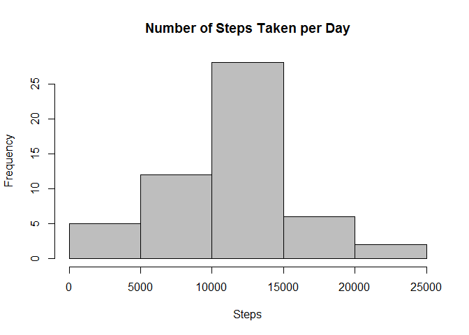
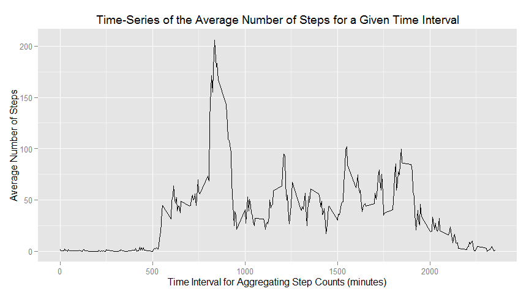
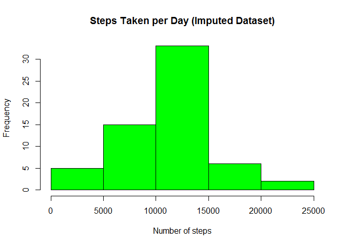
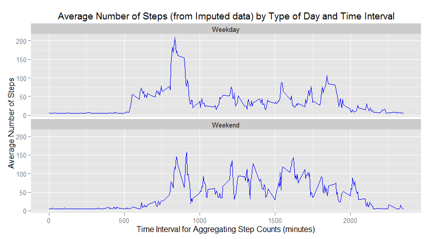

# Reproducible Research: Peer Assessment 1
Barry Obondo  
December 17, 2015  

## Background
This work was prepared as part of Peer Assessment 1 for Reproducible Research, Data Science Specialization, Johns Hopkins University on Coursera.  


## Introduction
### (as provided in the assignment)
It is now possible to collect a large amount of data about personal movement using activity monitoring devices such as a Fitbit,Nike Fuelband, or Jawbone Up. These type of devices are part of the "quantified self" movement -- a group of enthusiasts who take measurements about themselves regularly to improve their health, to find patterns in their behavior, or because they are tech geeks. But these data remain under-utilized both because the raw data are hard to obtain and there is a lack of statistical methods and software for processing and interpreting the data.

This assignment makes use of data from a personal activity monitoring device. This device collects data at 5 minute intervals through out the day. The data consists of two months of data from an anonymous individual collected during the months of October and November, 2012 and include the number of steps taken in 5 minute intervals each day.

## Data
### (as provided in the assignment)
The data for this assignment can be downloaded from the course web site:
*Dataset: Activity monitoring data [52K] - https://d396qusza40orc.cloudfront.net/repdata%2Fdata%2Factivity.zip

The variables included in this dataset are:
*steps: Number of steps taking in a 5-minute interval (missing values are coded as NA)
*date: The date on which the measurement was taken in YYYY-MM-DD format
*interval: Identifier for the 5-minute interval in which measurement was taken

The dataset is stored in a comma-separated-value (CSV) file and there are a total of 17,568 observations in this dataset.

## Assignment
This assignment will be described in multiple parts. You will need to write a report that answers the questions detailed below. Ultimately, you will need to complete the entire assignment in a single R markdown document that can be processed by knitr and be transformed into an HTML file.
Throughout your report make sure you always include the code that you used to generate the output you present. When writing code chunks in the R markdown document, always use echo = TRUE so that someone else will be able to read the code. This assignment will be evaluated via peer assessment so it is essential that your peer evaluators be able to review the code for your analysis.
For the plotting aspects of this assignment, feel free to use any plotting system in R (i.e., base, lattice, ggplot2)


## Assignment Work

### Loading and preprocessing the data

Set working directory (not shown) and load required packages


```r
# load required packages
library(dplyr)
```

```
## 
## Attaching package: 'dplyr'
## 
## The following objects are masked from 'package:stats':
## 
##     filter, lag
## 
## The following objects are masked from 'package:base':
## 
##     intersect, setdiff, setequal, union
```

```r
library(lubridate)
library(ggplot2)
```

The next step is to download, unzip and load the data file onto a data frame. 

```r
filezip <- "repdata%2Fdata%2Factivity.zip"

# download dataset file if does not exist
if(!file.exists(filezip)){
  datasetURL <- "http://d396qusza40orc.cloudfront.net/repdata%2Fdata%2Factivity.zip"
   # for the URL, 'https' does not work when running the code in knitr
  download.file(datasetURL, destfile="activity.zip")}

# unzip dataset if not yet unzipped
if(!file.exists("activity.csv")){
    unzip("activity.zip")}

# load data
rawdata <-read.csv("activity.csv")
rawdata <- tbl_df(rawdata)

# convert date to POSIXct (date) format
rawdata$date <- ymd(rawdata$date)
```


```r
str(rawdata) # check variable format conversions
```

```
## Classes 'tbl_df', 'tbl' and 'data.frame':	17568 obs. of  3 variables:
##  $ steps   : int  NA NA NA NA NA NA NA NA NA NA ...
##  $ date    : POSIXct, format: "2012-10-01" "2012-10-01" ...
##  $ interval: int  0 5 10 15 20 25 30 35 40 45 ...
```

Once the data has been loaded and pre-processed, a quick look indicated that the data has missing values (NAs).  A separate dataframe was created where the missing values are removed. This will be needed for later steps.


```r
# remove missing values
rawdata_noNA <- na.omit(rawdata)
```


### What is mean total number of steps taken per day?

**Make a histogram of the total number of steps taken each day**  
Making the histogram requires the total number of steps taken for each day. This can be calculated by summing up all steps for each day. 


```r
# aggregate steps by day
steps_per_day <- aggregate(steps ~ date, rawdata_noNA, sum)

# histogram
hist(steps_per_day$steps, main="Number of Steps Taken per Day",  
     xlab="Steps", ylab="Frequency", col="Grey")
```

 

**Calculate and report the mean and median total number of steps taken per day**  

```r
# Mean and median of total number of steps taken per day (removed NA)
mean_stepsperday <- mean(steps_per_day$steps)
median_stepsperday <- median(steps_per_day$steps)

mean_stepsperday
```

```
## [1] 10766.19
```

```r
median_stepsperday 
```

```
## [1] 10765
```


### What is the average daily activity pattern?

**Make a time series plot (i.e. type = "l") of the 5-minute interval (x-axis) and the average number of steps taken, averaged across all days (y-axis)**  
Making the histogram requires; calculating the average number of steps taken for each time interval, and  plotting that against the interval.  
**Note:** This step uses the original data (rawdata) with missing values in the data.


```r
# calculate mean steps for each time interval
steps_per_interval <- aggregate(steps ~ interval, rawdata, mean)

# plot mean step by interval
timeintervalplot <- ggplot(steps_per_interval, aes(interval, steps)) + 
    geom_line() +
    ggtitle(expression("Time-Series of the Average Number of Steps for a Given Time Interval")) +
    xlab("Time Interval for Aggregating Step Counts (minutes)") +
    ylab("Average Number of Steps")
print(timeintervalplot)
```

 

**Which 5-minute interval, on average across all the days in the dataset, contains the maximum number of steps?**

```r
#find the position (index) of max value
max_index <- which.max(steps_per_interval[,"steps"])
max_index
```

```
## [1] 104
```

```r
# look up max interval value in the index position
max_interval <- steps_per_interval[max_index, 1]  
max_interval
```

```
## [1] 835
```

### Imputing missing values

**Calculate and report the total number of missing values in the dataset (i.e. the total number of rows with missing values (NAs))**

The number of missing values can be determined as follows:

```r
sumNAvalues <- length(which(is.na(rawdata$steps)))
sumNAvalues
```

```
## [1] 2304
```
**Devise a strategy for filling in all of the missing values in the dataset. The strategy does not need to be sophisticated. For example, you could use the mean/median for that day, or the mean for that 5-minute interval, etc.**  

The strategy chosen is to replace missing values with the average (mean) value for each day of the week (e.g. Monday, Tuesday etc.). With this strategy, if there is a missing value for the steps for a Monday, it will be filled (imputed) by the mean number of steps for Mondays.

**Create a new dataset that is equal to the original dataset but with the missing data filled in.**

Step 1: Use the *date* variable to assign the day of the week (e.g. Monday, Tuesday etc) to each observation.

```r
# Initialize dataframe
imputedata <-tbl_df(rawdata)

# create new variable to assign days of the week
imputedata$day <- weekdays(as.Date(imputedata$date))
```

Step 2: Calculate means of steps taken for each type of day (e.g. Monday, Tuesday etc.). This creates a new table with each day of the week, and mean value for steps taken for each type of day.


```r
# create data frame with mean for each day
meanDay <- as.data.frame(aggregate(steps ~ day, imputedata, mean))
```

Step 3: Merge the calculated means for type of days, with the rest of the dataset . This create a new variable in the data frame that assigns a mean for steps to each observation for each respective day. 


```r
# create merge dataset with merged mean day
imputedata2 <- merge(imputedata, meanDay, by=c("day"))

# rename(imputedata2, steps=steps.x, dayAverage=steps.y)
names(imputedata2)[2:5] <- c("steps", "date", "interval", "dayAverage")

# sort by date and interval
imputedata2 <- imputedata2[order(imputedata2$date, imputedata2$interval),]
```

Step 4: Create new variable *imputedSteps* from duplicating the *steps* variable. Assign all NAs in this variable with the value of the respective day's mean: 


```r
# create new variable that will be populated with 'steps' 
# unless it is NA for which it will be populated by the 'Daily Average' value

imputedata2$imputedSteps <- ifelse(is.na(imputedata2$steps), 
                                   imputedata2$dayAverage, imputedata2$steps)
```

Step 5: New data set with imputed values

```r
# New dataset with imputed values (drop 'steps' dataset)
imputedFinal <- select(imputedata2, date, day, imputedSteps, interval)
```


**Make a histogram of the total number of steps taken each day**


```r
# aggregate steps by day for the imputed data set
imputedSteps_per_day <- aggregate(imputedSteps ~ date, imputedFinal, sum)

# histogram of steps by day for the imputed data set
hist(imputedSteps_per_day$imputedSteps, main="Steps Taken per Day (Imputed Dataset)",  
     xlab="Number of steps", ylab="Frequency", col="green")
```

 

**Calculate and report the mean and median total number of steps taken per day.**

Use the summed 'steps per day' calculated above to obtain mean and median per day for the imputed data:

```r
# Mean and median of steps taken per day
mean_ImputedStepsperday <- mean(imputedSteps_per_day$imputedSteps)
median_Imputedstepsperday <- median(imputedSteps_per_day$imputedSteps)
mean_ImputedStepsperday
```

```
## [1] 10821.21
```

```r
median_Imputedstepsperday
```

```
## [1] 11015
```

**Do these values differ from the estimates from the first part of the assignment?**

Create a table to compare:

```r
# table for comparison of mean and median for data with removed missing values, and that with imputed values
imputed_vs_noNAs <- matrix(c(mean_stepsperday, median_stepsperday, mean_ImputedStepsperday, median_Imputedstepsperday ),ncol=2,byrow=TRUE)
colnames(imputed_vs_noNAs) <- c("Mean","Median")
rownames(imputed_vs_noNAs) <- c("Missing Values Removed","Imputed Missing Values")
imputed_vs_noNAs  <- as.table(imputed_vs_noNAs)
imputed_vs_noNAs
```

```
##                            Mean   Median
## Missing Values Removed 10766.19 10765.00
## Imputed Missing Values 10821.21 11015.00
```
As you can see, the data with missing values removed had a slightly lower mean and median. 

**What is the impact of imputing missing data on the estimates of the total daily number of steps?**  
Imputation seems to increase the mean and median of the toal daily number of steps.

### Are there differences in activity patterns between weekdays and weekends?

For this part the *weekdays()* function may be of some help here. Use the dataset with the filled-in missing values (imputed) for this part.

**Create a new factor variable in the dataset with two levels -- "weekday" and "weekend" indicating whether a given date is a weekday or weekend day.**


```r
# create a new variable to assign weekday/weekend property for each observation
imputedFinal$wkdwknd <- ifelse(imputedFinal$day %in% c("Saturday", "Sunday"), "Weekend", "Weekday")

# check updated data frame with the new variable
head(imputedFinal)
```

```
##            date    day imputedSteps interval wkdwknd
## 2593 2012-10-01 Monday     34.63492        0 Weekday
## 2594 2012-10-01 Monday     34.63492        5 Weekday
## 2595 2012-10-01 Monday     34.63492       10 Weekday
## 2596 2012-10-01 Monday     34.63492       15 Weekday
## 2597 2012-10-01 Monday     34.63492       20 Weekday
## 2598 2012-10-01 Monday     34.63492       25 Weekday
```


**Make a panel plot containing a time series plot (i.e. type = "l") of the 5-minute interval (x-axis) and the average number of steps taken, averaged across all weekday days or weekend days (y-axis).**

Step 1: Use the imputed data to calculate the average (mean) number of steps taken in  each time interval


```r
# calculate mean of steps for each interval
imputedStepsInterval <- aggregate(imputedSteps ~ interval, imputedFinal, mean)
```

Ste 2: Group the interval means by type of day (i.e. weekday or weekend)


```r
# group by weekday and weekend
groupByday <- group_by(imputedFinal, interval, wkdwknd)
averageStepsDay <- summarize(groupByday, averageImputedSteps = mean(imputedSteps))
```

Step 3: Plot average steps per day by type of day in a 2 by 1 panel


```r
wkdwkndAverage <- ggplot(averageStepsDay, aes(x=interval, y=averageImputedSteps)) + 
  geom_line(color="blue") + 
  facet_wrap(~ wkdwknd, nrow=2, ncol=1) +
  ggtitle(expression("Average Number of Steps (from Imputed data) by Type of Day and Time Interval")) +
  xlab("Time Interval for Aggregating Step Counts (minutes)") +
  ylab("Average Number of Steps")

print(wkdwkndAverage)
```

 

